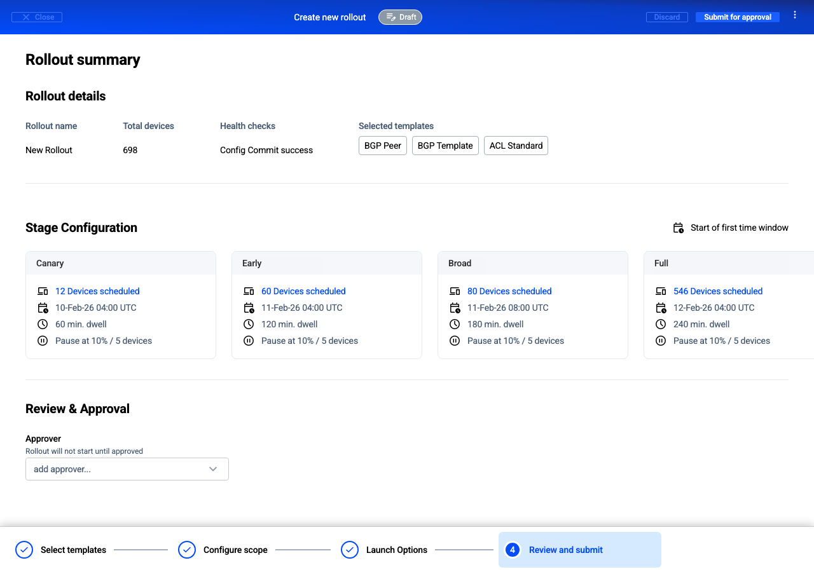

### Preview

### Prompt

Implement this design from Figma.
@https://www.figma.com/design/6PzD1I7Xf9UaFkJArGyVAF/DAP-25?node-id=23625-311964&m=dev @App.tsx

### Results

- After first shot everything is up and running

#### Problems

- Didn't use <DsStepper> component
- <DsButton> is used with "tiny" size instead of "small"
- Didn't use <StatusBadge> component
- Didn't use <DsDropdownMenu> to build Action Menu
- Didn't use <DsFormControl> to wrap <DsSelect>
- Used <DsSelect> without options and possibility to edit
