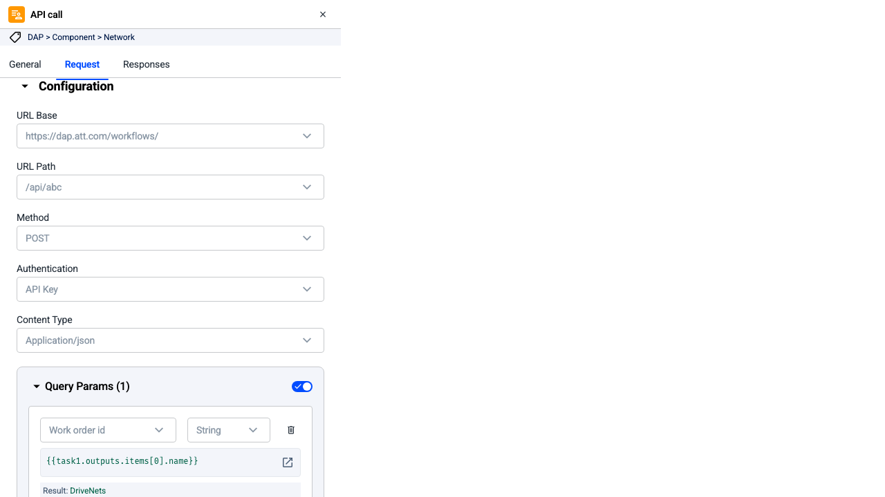

### Preview

 TODO

### Prompt

Implement this design from Figma.
@https://www.figma.com/design/6PzD1I7Xf9UaFkJArGyVAF/DAP-25?node-id=17013-242326&m=dev

### Results

- After first shot everything is up and running

#### Problems

- ✅ native <button> is used for all buttons instead of DsButton
- ✅ DsTypography is not used at all
- ✅ wrong size in px is passed into <DsIcon>, `size: "small" | "tiny" | "medium" | "large" | "extra-large"`
- 🔴 deprecated css variables are used; multiple hardcoded colors
