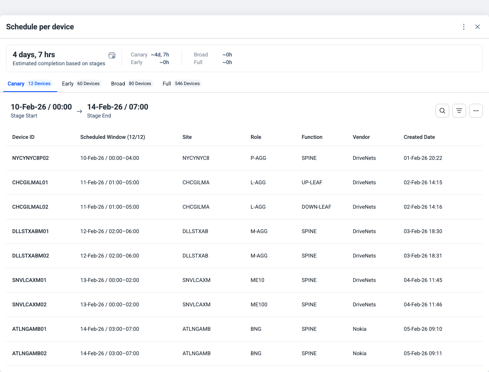

### Preview

### Prompt

Implement this design from Figma.
@https://www.figma.com/design/6PzD1I7Xf9UaFkJArGyVAF/DAP-25?node-id=23625-312423&m=dev @App.tsx

### Results

- On first shot agent stuck getting Figma context.
- After message "Something went wrong, you're stuck" everything is up and running

#### Problems

- Didn't use <DsModal> component
- Didn't use <DsTabs> component
- Didn't use <DsTable> component, used native <table> instead
- Didn't use <DatePicker>
- native <button> is used for all buttons instead of DsButton
- native <svg> are used instead of <DsIcon>
- DsTypography is not used at all
- didn't use DsDropdownMenu to build Action Menu
